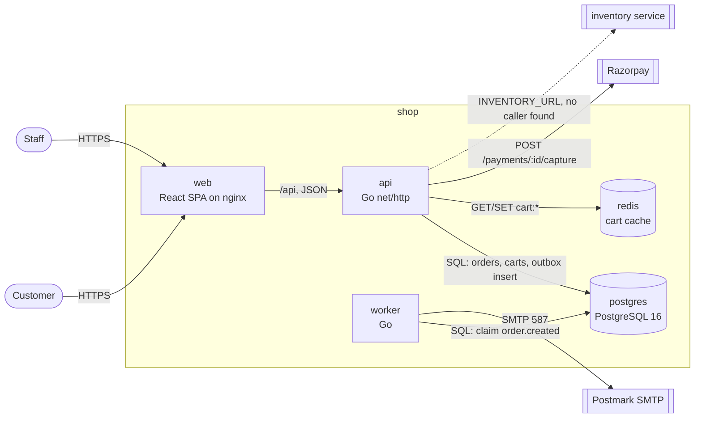
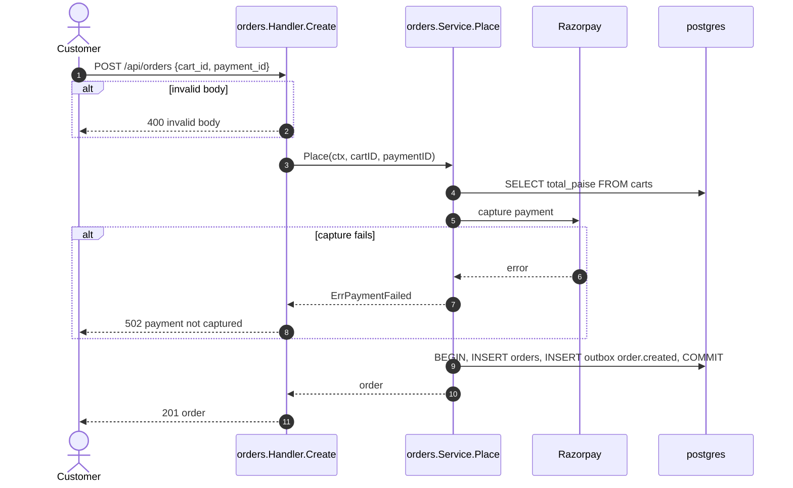

# Shop architecture

Last updated: 2026-06-02 (release 1.8.0). Drawn from `k8s/`,
`docker-compose.yml` and the Go sources.

## Containers

## Place an order (POST /api/orders)

## Sources

| Element | Where |
| --- | --- |
| api, worker | k8s/api.yaml, k8s/worker.yaml |
| postgres | DATABASE_URL in k8s secrets, docker-compose.yml |
| redis | REDIS_ADDR in k8s/api.yaml, internal/cart/redis.go |
| outbox | internal/outbox/outbox.go |
| Razorpay | internal/payments/client.go |
| Postmark | SMTP_HOST in k8s/worker.yaml, internal/mail/mail.go |
| inventory | INVENTORY_URL in k8s/api.yaml (no caller) |

## Notes

- mailhog in docker-compose.yml is a local email catcher and is not drawn.
