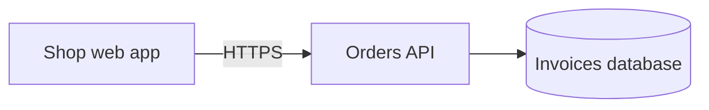

# Orders hub: High-Level Design

Status: Draft

## 1. Goal

Show overdue invoices. assumption: invoices come from the existing billing export.

## 2. Architecture

```mermaid
flowchart LR
  web[Shop web app] -->|HTTPS| api[Orders API] --> db[(Invoices database)]
```
