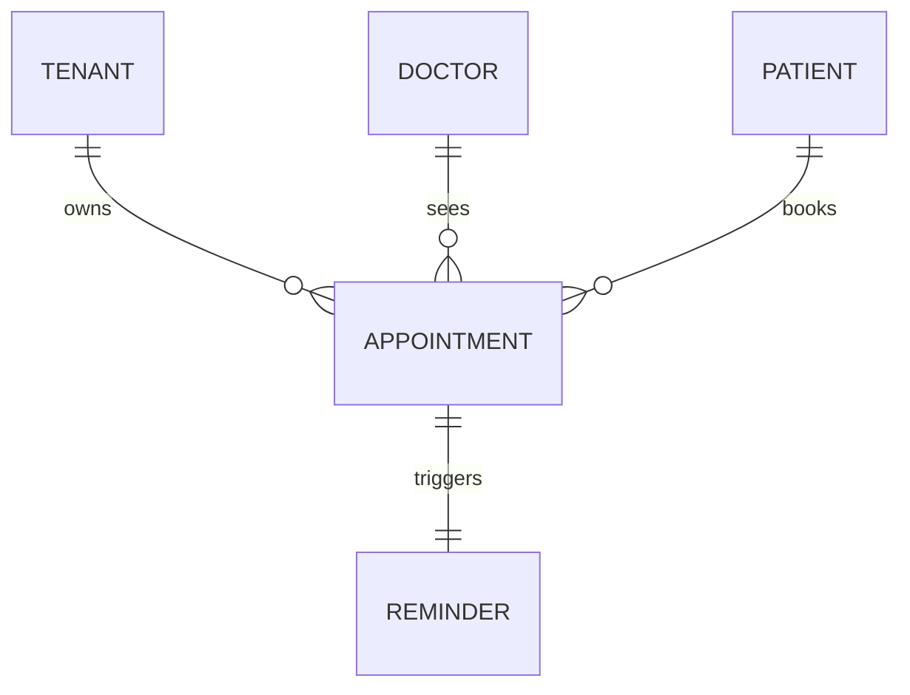

# Data model: appointments and reminders

- Task: CLN-41
- Serves: US-05-001 to US-05-007
- Store: PostgreSQL 16 (ADR 0001); money per ADR 0002
- Status: Approved, 2 July 2026

## 1. Entities

| Entity | Owner | Created by | Ended by | Stories | PII | Retention |
| --- | --- | --- | --- | --- | --- | --- |
| appointment | booking module | US-05-002 | archive after 7 years | US-05-001, 002, 003, 005, 006, 007 | yes (reason_for_visit) | 7 years after the appointment date |
| reminder | booking module | US-05-002 (one per appointment) | deleted with its appointment | US-05-004 | no (phone is read from patients) | follows its appointment |

Not modelled: waitlist and telehealth rooms (phase 2, no story).

## 2. Relationships

## 3. appointments (hot: yes, about 3.1 million rows in September 2026, writes every few seconds in clinic hours)

Created by migrations/0003_appointments.sql. Statuses: booked,
cancelled, completed, no_show.

| Index or constraint | Columns | Serves |
| --- | --- | --- |
| appointments_no_overlap | EXCLUDE gist (doctor_id =, tstzrange(starts_at, ends_at) &&) WHERE status <> 'cancelled' | US-05-002: no overlapping appointments for a doctor; a cancelled slot is free (US-05-003) |
| idx_appointments_tenant_doctor_starts | (tenant_id, doctor_id, starts_at) | US-05-001 day view |
| idx_appointments_tenant_patient_starts | (tenant_id, patient_id, starts_at DESC) | US-05-005 history, newest first |

## 4. reminders (hot: no)

Created by migrations/0004_reminders.sql.

| Index | Columns | Serves |
| --- | --- | --- |
| idx_reminders_appointment_id | (appointment_id) | FK lookup, front desk delivery status (US-05-004) |
| idx_reminders_pending_send_at | (send_at) WHERE status = 'pending' | sender job: pending reminders due now |

## 5. Retention and PII

| Column | Kind | Retention | Mechanism |
| --- | --- | --- | --- |
| appointments.reason_for_visit | health information | 7 years with the appointment | yearly archive job (not built yet) |
| patients.phone | contact | not agreed | UNDEFINED |

## 6. Migrations

| # | File | Phase | Notes |
| --- | --- | --- | --- |
| 1 | 0003_appointments.sql | expand | new table, no lock risk |
| 2 | 0004_reminders.sql | expand | new table, no lock risk |

## 7. Open questions

- Retention for patients.phone: owner product, by 30 September 2026.
