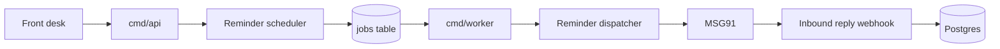

# High Level Design: Appointment reminders

Version: v1

- Task: CLIN-41
- Author: clinics team, 2026-09-18, status: Approved (design review 2026-09-18)
- PRD: docs/product/PRD.md
- ADRs: ADR-0001, ADR-0002, ADR-0003
- Serves: REQ-201, REQ-202, REQ-203, REQ-204, REQ-205, REQ-206

## 1. Goal and non-goals

Patients get an SMS 24 hours and 2 hours before each booked appointment.
Cancelled or opted-out patients get nothing, and a rescheduled appointment
is reminded for its new time only. Clinic admins can switch reminders off.

Non-goals:
- WhatsApp or email reminders.
- Confirming or rescheduling by reply.
- Walk-in appointments.

## 2. Users and flows

Flow A, booking:
1. Front desk books an appointment (POST /appointments).
2. The scheduler writes two reminder jobs (24 h and 2 h before starts_at).

Flow B, sending:
1. The worker picks up a due reminder job.
2. The dispatcher loads the appointment, patient and clinic, checks status
   and opt-out, and sends the SMS through MSG91.

Flow C, opting out:
1. The patient replies STOP.
2. MSG91 calls our inbound webhook; we set patients.sms_opt_out.

## 3. Architecture

Reminder scheduler (in cmd/api, clinics team): on create, reschedule and
cancel, writes or cancels reminder jobs of kind `reminder.send` in the same
transaction as the appointment change.

Reminder dispatcher (in cmd/worker, clinics team): handles `reminder.send`
jobs, re-checks the appointment and opt-out at send time, and calls
internal/sms.

Inbound reply webhook (in cmd/api, clinics team): POST /webhooks/sms/inbound,
verifies the MSG91 call and sets patients.sms_opt_out on STOP.

## 4. Data

- jobs rows of kind `reminder.send`, payload `{appointment_id, kind: "24h"|"2h", starts_at}`.
- clinics.reminders_enabled (new column, default true).
- patients.sms_opt_out (exists, migrations/0004).
- Retention: done reminder jobs deleted after 30 days.

## 5. Interfaces

- POST /webhooks/sms/inbound (new), contract in api/openapi.yaml (to write).
- PATCH /clinics/{id} gains reminders_enabled (new).
- MSG91 flow API (existing client, internal/sms).

## 6. Failure modes

| Component | What fails | How we notice | What the user sees | Recovery |
| --- | --- | --- | --- | --- |
| Scheduler | job insert fails | booking returns 500 | front desk retries booking | transaction rolls back |
| Dispatcher | MSG91 returns 429 | job marked failed | patient gets no reminder | UNDEFINED |
| Dispatcher | MSG91 down or timeout | job marked failed | patient gets no reminder | UNDEFINED |
| Dispatcher | worker process down | jobs pile up | reminders late | restart; due jobs run late |
| Inbound webhook | MSG91 cannot reach us | UNDEFINED | patient keeps getting reminders | UNDEFINED |

## 7. Scaling and limits

- 90,000 appointments a day, so 180,000 reminders a day.
- Burst: about 12,000 2-hour reminders are due at 07:00 on weekdays.
- First bottleneck: the worker poll, 50 jobs every 5 s, so 10 jobs a second
  (internal/jobs/worker.go). 12,000 jobs take 20 minutes, which misses
  REQ-203 (10 minutes). The design stops meeting REQ-203 above 6,000
  reminders due in the same minute.
- Plan: raise the batch to 200 and the poll to 2 s (100 jobs a second).
  Then MSG91 at 20 requests a second is the bottleneck: 12,000 take 10
  minutes, exactly the REQ-203 limit.

## 8. Security and privacy

- PII: patient phone and name. The message never includes appointments.reason.
- Inbound webhook: verified by a shared secret header (MSG91_WEBHOOK_SECRET).
- Secrets: SMS_API_KEY, MSG91_WEBHOOK_SECRET.

## 9. Observability

- Metric: reminders sent, failed, and lag behind run_at.
- Alert: lag over 5 minutes, runbook docs/runbooks/reminders-lag.md (to write).

## 10. Rollout and rollback

1. Ship the scheduler behind REMINDERS_ENABLED=false; no jobs written.
2. Enable for five pilot clinics through clinics.reminders_enabled.
3. Enable for all.
Back out: set REMINDERS_ENABLED=false; the dispatcher skips pending
reminder jobs, which then expire.

## 11. Open questions and assumptions

- assumption: MSG91 inbound webhook supports a shared secret header. Owner: clinics tech lead, 2026-09-30.
- Retry policy for 429 and 5xx is undecided. Owner: clinics tech lead, 2026-09-30.

## Revision history
