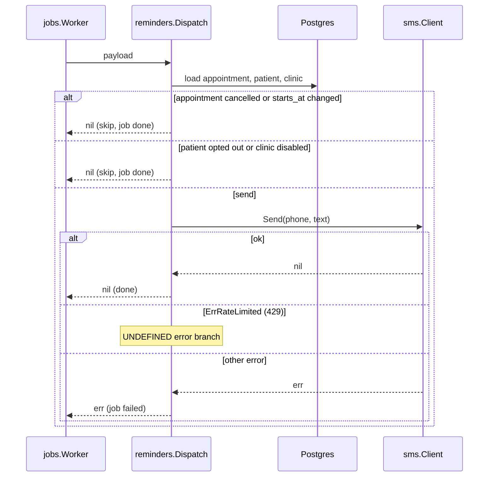

# Low Level Design: Reminder dispatcher

Version: v1

- Task: CLIN-44, HLD: docs/design/appointment-reminders-hld.md, ADRs: ADR-0002, ADR-0003
- Author: clinics team, 2026-09-21, status: Approved
- Serves: REQ-201, REQ-202, REQ-203, REQ-204, REQ-205

## 1. Scope

The reminder dispatcher inside cmd/worker: it handles `reminder.send` jobs
and sends one SMS per job. Scheduling jobs and inbound replies are other
components of the HLD and are not covered here.

## 2. Module layout

- internal/reminders/dispatch.go (new): the `reminder.send` handler.
- internal/reminders/message.go (new): builds the message text.
- internal/reminders/dispatch_test.go (new).
- internal/jobs/worker.go (existing): batch 200, poll 2 s, claim with SKIP LOCKED.
- internal/sms/client.go (existing): unchanged.
- cmd/worker/main.go (existing): registers the handler.

## 3. Types and schemas

```go
type Payload struct {
    AppointmentID int64     `json:"appointment_id"`
    Kind          string    `json:"kind"` // "24h" | "2h"
    StartsAt      time.Time `json:"starts_at"`
}
```

Validated once, in Dispatch, on decode. An unknown kind fails the job.

## 4. Sequence



## 5. Data access

- Claim: `SELECT ... FROM jobs WHERE status = 'pending' AND run_at <= now() ORDER BY run_at LIMIT 200 FOR UPDATE SKIP LOCKED`, index jobs_due_idx.
- Load: appointments by primary key; patients by primary key; clinics by primary key.
- Transaction: the claim and the status update share one transaction; the SMS call happens after the claim commits the job to `running`.
- Migrations: 0005_clinics_reminders_enabled.sql adds clinics.reminders_enabled.

## 6. Errors

- ErrUnknownKind (dispatch.go): job failed, logged.
- sms errors: returned to the worker, job failed.

## 7. Configuration

| Variable | Default | When missing |
| --- | --- | --- |
| REMINDERS_ENABLED | false | dispatcher skips every reminder job |
| SMS_API_KEY | none | worker fails to start |

## 8. Tests

- TestDispatchSkipsCancelled (REQ-204)
- TestDispatchSkipsRescheduled (REQ-204)
- TestDispatchSkipsOptedOut (REQ-205)
- TestDispatchMessageHasNoReason
- TestDispatchSendError

## 9. Work breakdown

1. Worker claim with SKIP LOCKED, batch 200, poll 2 s: internal/jobs/worker.go, about 60 lines.
2. Migration 0005 and clinics.reminders_enabled: about 20 lines.
3. Dispatcher and message builder with tests: internal/reminders/*, about 220 lines.
4. Register the handler in cmd/worker/main.go: about 10 lines.

## Revision history
