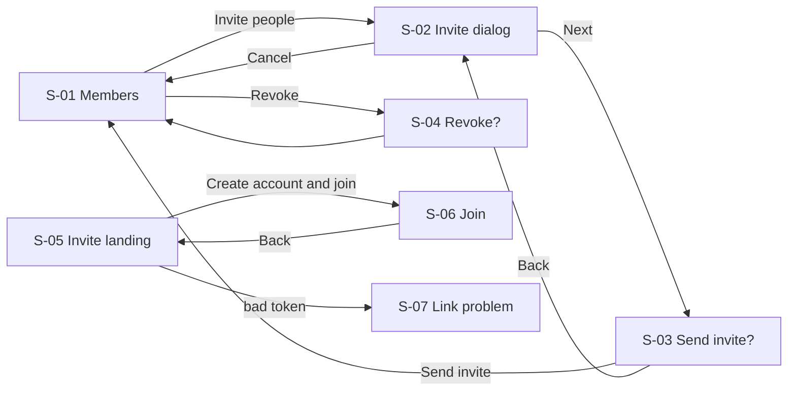

# Team invites: user flows (v1)

Status: reviewed 18 Sep 2026 (notes in docs/design/reviews/2026-09-18-invite-flows-review.md)
Source: docs/product/backlog.md, epic E-7 (US-210 to US-214)

Goal: an admin adds a teammate by email, and the teammate lands in the
right workspace from the email link.

US-211 (members invite) is not designed: ADR-0004 keeps membership with
admins. Members see the member list without invite controls.

## Screens

| Id | Screen | Status | Stories | Entry | Exits |
|---|---|---|---|---|---|
| S-01 | Members (/settings/members) | existing, extended | US-210, US-213 | Left nav "Members" | S-02, S-04, other nav items |
| S-02 | Invite dialog | new | US-210 | S-01 "Invite people" | S-03, Cancel to S-01 |
| S-03 | Send invite? confirmation | new | US-214 | S-02 "Next" | Send to S-01, Back to S-02 |
| S-04 | Revoke invite? confirmation | new | US-213 | S-01 row "Revoke" | Revoke to S-01, Cancel to S-01 |
| S-05 | Invite landing (/invite/:token) | new | US-212 | Email link | S-06, sign in, S-07 |
| S-06 | Join with a new account | new | US-212 | S-05 "Create account and join" | /schedule of the inviting workspace, back to S-05 |
| S-07 | Invite link problem | new | US-212 | S-05 on an expired, revoked or used token | /login, S-05 of a new invite |

## States

### S-01 Members
| State | What the user sees |
|---|---|
| Loading | Table skeleton, title "Members" |
| Empty | n/a: the admin is always a member |
| Error | "We could not load members. Check your connection and try again." [Try again] |
| Success | Members table; "Pending invites" section with email, sent date, [Resend] [Revoke]; admins see [Invite people] |
| Partial | Members load, pending invites fail: "Pending invites did not load." [Try again] |

### S-02 Invite dialog
| State | What the user sees |
|---|---|
| Loading | n/a: nothing to fetch |
| Empty | Email field, hint "Their work email. They get a link to join Acme." [Next] disabled |
| Error | Inline under the field. INVALID_EMAIL: "That is not an email address." ALREADY_MEMBER: "x is already in Acme." INVITE_PENDING: "x already has an invite. Resend it from Pending invites." DOMAIN_NOT_ALLOWED: "Only @acme.test addresses can join Acme." SEAT_LIMIT: "Starter includes 5 seats and all are used or held by pending invites. Upgrade to Pro or revoke a pending invite." [Go to billing] |
| Success | Moves to S-03 |
| Partial | n/a: one address per invite |

### S-03 Send invite? confirmation
| State | What the user sees |
|---|---|
| Loading | [Send invite] shows "Sending" and is disabled |
| Empty | n/a |
| Error | RATE_LIMITED: "You have sent a lot of invites in the last minute. Try again in a minute." Other: "The invite was not sent. Try again." |
| Success | Starter: "Send an invite to x?" Pro: "Send an invite to x? When they join, Acme is billed for 1 more seat at $8 a month." [Send invite] [Back]. After send: toast "Invite sent to x", back to S-01 |
| Partial | n/a |

### S-04 Revoke invite? confirmation
| State | What the user sees |
|---|---|
| Success | "Revoke the invite to x? The link in their email will stop working." [Revoke invite] [Cancel] |
| Error | "The invite was not revoked. Try again." |
| Loading, Empty, Partial | n/a: a single action on known data |

### S-05 Invite landing
| State | What the user sees |
|---|---|
| Loading | "Checking your invite" |
| Success | "Join Acme on Crewbook. Owner invited x." [Create account and join] [I have an account, sign in] |
| Error | EMAIL_MISMATCH (signed in as another address): "You are signed in as y. This invite is for x." [Sign out and switch] |
| Empty, Partial | n/a |

### S-06 Join with a new account
| State | What the user sees |
|---|---|
| Empty | Email prefilled and locked to x, password field, [Create account and join Acme] |
| Error | "Password needs at least 10 characters." Network: "Your account was not created. Try again." |
| Success | Lands on Acme's schedule with "Welcome to Acme" |
| Loading | Button shows "Joining" |
| Partial | n/a |

### S-07 Invite link problem
| State | What the user sees |
|---|---|
| Expired | "This invite has expired. Invites are valid for 7 days. Ask Owner for a new one." [Sign in] |
| Revoked | "This invite was withdrawn. Ask Owner if you still need access." |
| Used | "This invite was already used." [Sign in] |

## Navigation

## Analytics

| Control | Event |
|---|---|
| S-03 Send invite | invite_sent (sheet) |
| S-06 Create account and join | invite_accepted (sheet) |
| S-01 Resend | needs event: invite_resent |
| S-04 Revoke invite | needs event: invite_revoked |

## Open questions

| # | Question | Owner | If deferred |
|---|---|---|---|
| 1 | Resend needs an API (only create, list, revoke exist) | Backend | Resend is hidden; admin revokes and invites again |
| 2 | S-05 and S-06 need a join path in the API: sign-up today always creates a new workspace | Backend | Invitees must sign up first, then open the link again |
