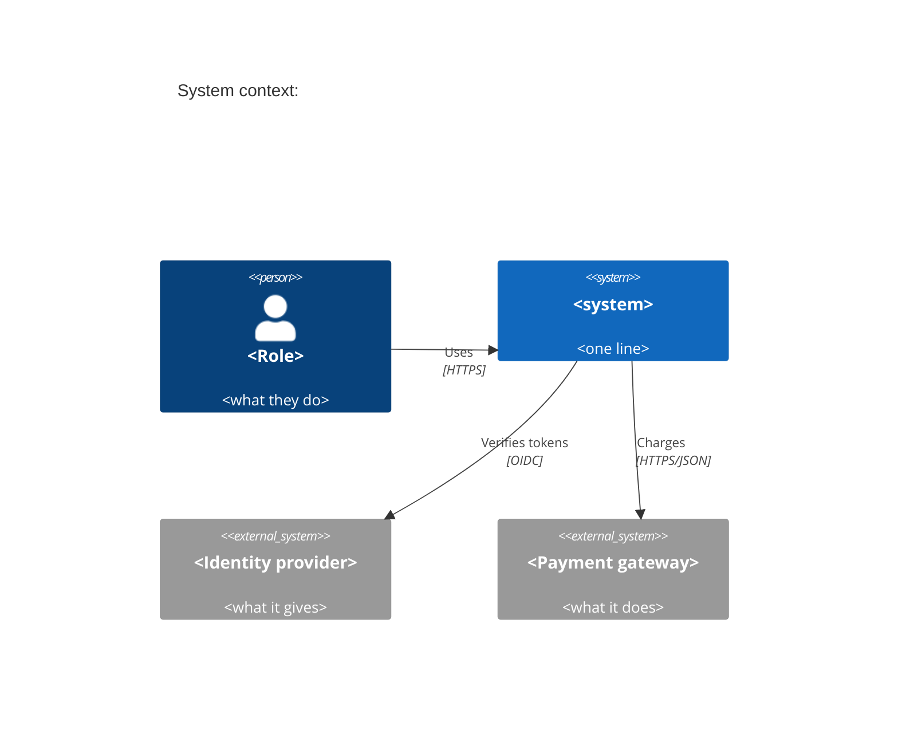
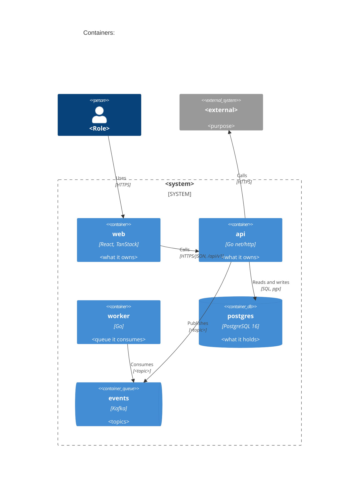
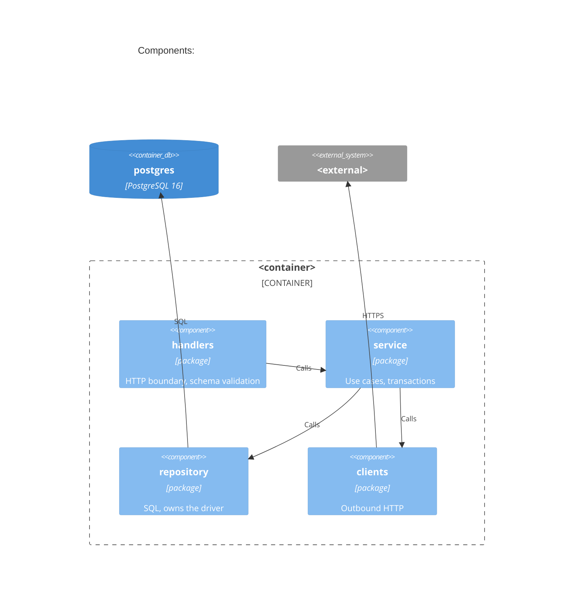
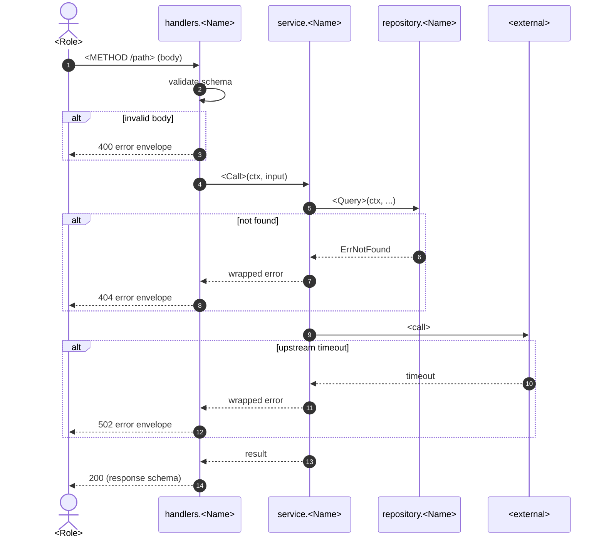

# Architecture: <system>

<!-- Template guidance: every section below carries a comment saying what goes
     there (What), what a strong entry has (Good) and a one-line example
     (Example). Delete each comment when you fill its section. This shows the
     system as the code says it is, not as the README remembers it; every box
     and edge names its source, and anything inferred from a name alone goes
     on the unconfirmed list. Use only the mermaid shapes shown below. -->

- Task: TASK-ID
- Serves: REQ-nnn, US-nn-nnn, ADR-nnnn
- Generated from the code on <date> by architecture-diagram
- Sources: compose <file>, k8s <dir>, packages <dir>

## 1. Context

<!-- What: the system as one box, its users (from auth roles and the PRD)
     and the external systems it calls (hosts in config).
     Good: one Rel per real call, labelled with the protocol; no auth roles
     and no PRD means one box "user (unconfirmed)".
     Example: Rel(sys, pay, "Creates charges", "HTTPS/JSON") from
     PAYMENTS_BASE_URL in .env.example:9. -->

## 2. Containers

<!-- What: one box per compose service or k8s workload, plus each store and
     queue, and the edges between them.
     Good: edges come from env vars pointing at a host or from client code;
     an edge with only a name behind it is dashed and listed as unconfirmed.
     When both exist, draw prod (k8s) and note dev-only services in the legend.
     Example: Rel(api, q, "Publishes", "orders.created") from the producer at
     internal/events/publish.go:27. -->

## 3. Components: <container>

<!-- What: for one container (default: the one with the most modules), one
     box per package and the edges between them.
     Good: edges come from imports; packages under 30 lines, test doubles and
     generated code are skipped and the legend says so.
     Example: Rel(s, cl, "Calls") because internal/orders/service.go:8
     imports internal/clients/payments. -->

## 4. Sequences

<!-- What: one subsection per traced flow: each --flow given, or else the
     two busiest routes.
     Good: every flow is traced in the code, not drawn from memory; a
     sequence with no file references is a guess.
     Example: "### Place order (POST /api/v1/orders, US-02-004)" -->

### <flow name> (<METHOD /path>, US-nn-nnn)

<!-- What: the path from handler to service to repository to external call,
     with participants named after the real functions.
     Good: an alt branch wherever the code has one; a path with no error
     handling gets the note "no error branch in code".
     Example: participant S as service.PlaceOrder
     (internal/orders/service.go:54). -->

## 5. Legend

<!-- What: what each box and edge style means and what was left out.
     Good: names every skip with its reason (packages under 30 lines, test
     doubles, generated code, dev-only compose services).
     Example: "| Dev only | mailhog, adminer: in docker-compose.yml, not in
     k8s/; not drawn |" -->

| Style | Meaning |
| --- | --- |
| Solid edge | Call found in code or config (file:line in the sources table) |
| Dashed edge | Inferred from a name only; listed under Unconfirmed |
| Skipped | Packages under 30 lines, test doubles, generated code |

## 6. Sources

<!-- What: one row per box and per edge drawn solid: the element, the file
     and the line that proves it.
     Good: every element in the diagrams appears here or under Unconfirmed;
     the line points at the call, env var or manifest entry, not the file top.
     Example: "| api -> postgres | k8s/prod/api-deployment.yaml | 41 |" -->

| Element | File | Line |
| --- | --- | --- |
| api | docker-compose.yml | 12 |

## 7. Unconfirmed

<!-- What: every dashed edge and every element drawn without a call site,
     env var or manifest behind it.
     Good: says what it was inferred from and who can confirm it; the count
     matches the output contract.
     Example: "worker -> billing-api: inferred from the queue name
     billing.invoice only; confirm with the payments team." -->

- <edge or element>: inferred from <what>; confirm with <owner>
