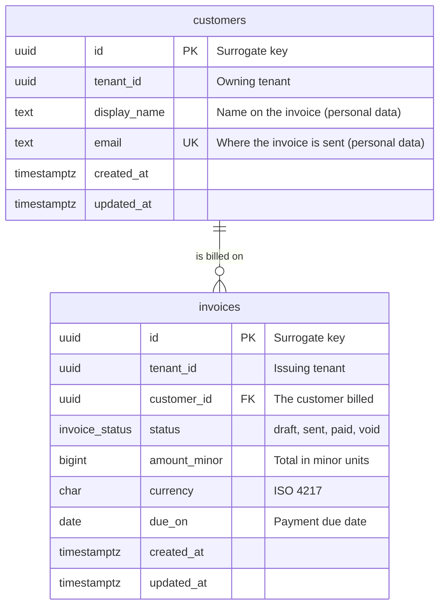

# Entity relationship diagram: <scope>

<!-- Template guidance: the picture a reviewer opens first, written beside
     docs/design/data-model.md from the same design. Delete each comment
     when you fill its section. It covers the Postgres tables in schema.sql
     (and, when used, the Mongo collections and ClickHouse tables, each in
     its own diagram). Every table in schema.sql appears here and every
     foreign key is a relationship line; a table with no line says why in
     the Relationships section. -->

PostgreSQL. 2 tables, 1 relationship.

## Diagram

<!-- What: one mermaid erDiagram: every table, its columns with type and
     PK, FK or UK marker, and every foreign key as a relationship with its
     cardinality and a short label.
     Good: cardinality matches the constraint (NOT NULL FK is ||, a unique
     FK is one-to-one), labels are verbs a reader can say aloud, and a
     column comment is short enough to stay on one line.
     Example: the diagram below. -->

## Relationships

<!-- What: one row per relationship line in the diagram: from, the
     cardinality in words, to, and one sentence saying what it means in the
     product and what the ON DELETE protects.
     Good: the sentence is about the domain (who owns what, what must
     survive), not a restatement of the FK.
     Example: the customers row below. -->

| From | | To | Meaning |
| --- | --- | --- | --- |
| customers | one-to-many | invoices | A customer is billed on many invoices; each invoice has exactly one customer, and a customer with invoices cannot be deleted (RESTRICT). |
