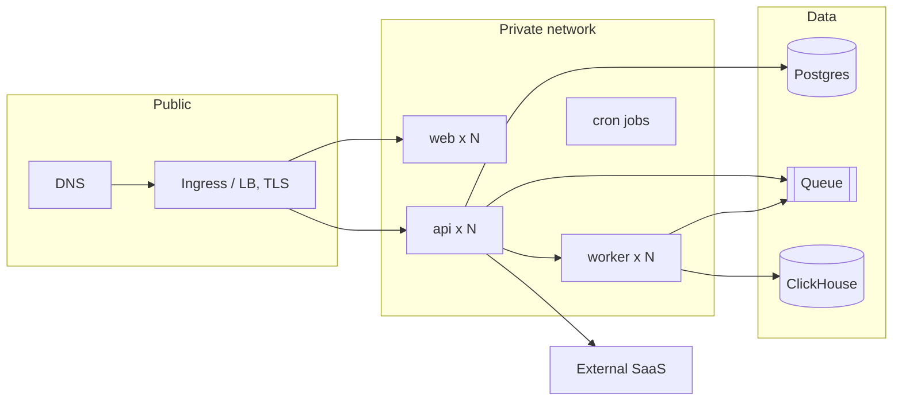

# Deployment architecture: <system>

<!-- Template guidance: every section below carries a comment saying what goes
     there (What), what a strong entry has (Good) and a one-line example
     (Example). Delete each comment when you fill its section. This is what
     the on-call engineer reads at 3 a.m. to know what runs where, how big it
     is and how to put it back. Every value is `value (file:line)` or
     `unconfirmed: <guess>`; never a hostname, IP or credential from memory. -->

- Serves: REQ-nnn, ADR-nnnn
- Sources: <infra repo path>, <CI file>, <compose files>
- Author, date, status (Draft | Reviewed | Approved)
- Convention: every value is `value (file:line)` or `unconfirmed: <guess>`

## 1. Environments

<!-- What: dev, qa and prod side by side: URL, cluster and namespace, node or
     instance size, replicas per workload, requests and limits, data.
     Good: every cell carries its file:line or starts "unconfirmed:"; sizes
     have units and replicas have min and max. Prod is never described from
     a compose file; that is "unconfirmed: from compose".
     Example: "Replicas (api / worker / web) | 1 / 1 / 1 (envs/dev/values.yaml:14)
     | 2 / 1 / 2 (envs/qa/values.yaml:14) | 3-10 / 2-6 / 3 (envs/prod/values.yaml:14)" -->

| | dev | qa | prod |
| --- | --- | --- | --- |
| URL | | | |
| Cluster / namespace | | | |
| Node or instance size | | | |
| Replicas (api / worker / web) | | | |
| Requests and limits | | | |
| Data | seeded | anonymised copy | live |

## 2. Topology (prod)

<!-- What: one mermaid flowchart per environment that differs, with subgraphs
     for the public, private and data boundaries; boxes for ingress, services,
     workers, cron jobs, stores, queues and external SaaS.
     Good: every edge comes from a Service or Ingress manifest or an env var
     pointing at a host; an edge inferred from a name alone goes under
     Unconfirmed. Replace the sample below with what the manifests show.
     Example: "api --> pg[(Postgres 16, orders-prod)]" from DATABASE_URL at
     k8s/prod/api-deployment.yaml:41. -->

## 3. Network and ingress

<!-- What: ingress class, TLS termination, certificates and renewal, WAF or
     rate limiter and its limits, private endpoints, egress rules, and the
     exact list of what the internet can reach.
     Good: each bullet names the manifest or terraform resource it came from;
     "everything else private" is written only when the manifests show it.
     Example: "TLS terminates at ingress-nginx with cert-manager, issuer
     letsencrypt-prod (helm/ingress/values.yaml:22), renewed 30 days early." -->

- Ingress class, TLS termination, certificates and renewal.
- WAF or rate limiter in front, and its limits.
- Reachable from the internet: <list>. Everything else private.
- Egress allowed to: <hosts>.

## 4. Scaling

<!-- What: per workload the HPA min, max and target, queue consumer counts,
     and the first thing that breaks as load grows.
     Good: the bottleneck is arithmetic, not an adjective: pool size times
     replicas against the store's max_connections, each number sourced.
     Example: "api | 3 | 10 | CPU 70% | DB connections: pool 20 x 10 = 200
     against max_connections 200 (terraform/rds.tf:31); full at max scale" -->

| Workload | Min | Max | Target | First bottleneck |
| --- | --- | --- | --- | --- |
| api | | | CPU 70% | DB connections: pool N x replicas M against max_connections K |

## 5. Data stores and backups

<!-- What: one row per store and queue: engine and version, size, backup
     mechanism, schedule, RPO, RTO and the date of the last restore test.
     Good: a store with no stated RPO or RTO says "unconfirmed: RPO/RTO not
     defined"; a backup never restored says "never tested", not blank.
     Example row: "| orders | PostgreSQL 16.3 (RDS) | 180 GB | automated
     snapshot + PITR | daily 02:00 UTC | 5 min | 1 h | 2026-06-12 |" -->

| Store | Engine, version | Size | Backup | Schedule | RPO | RTO | Last restore test |
| --- | --- | --- | --- | --- | --- | --- | --- |

## 6. Secrets and identity

<!-- What: the secret manager, how a secret reaches a pod, the workload
     identities and the roles they hold, who can read prod secrets, and the
     rotation period and mechanism.
     Good: names the people or groups with prod access, not "the team"; a
     secret with no rotation says so.
     Example: "AWS Secrets Manager via External Secrets Operator
     (k8s/prod/externalsecret.yaml:8); api uses IRSA role orders-api-prod,
     read on secret/orders/*; DB password rotated every 30 days by RDS." -->

- Secret manager: <name>. Injection: <env from secret | CSI | sidecar>.
- Workload identities and the roles they hold.
- Who can read prod secrets. Rotation period and mechanism.

## 7. CI to CD

<!-- What: the CI stages in order, the artefact and its tag scheme, the
     promotion from dev to qa to prod, and every gate.
     Good: every manual gate is named with who approves (`when: manual`,
     protected environments, required approvals) and its CI file line.
     Example: "| deploy prod | deploy:prod (.gitlab-ci.yml:88) | image
     registry.example.com/orders/api:<sha> | manual: release-managers group |" -->

| Stage | Job | Artefact | Gate |
| --- | --- | --- | --- |
| build | | image `<registry>/<name>:<sha>` | automatic |
| deploy qa | | | automatic on develop |
| deploy prod | | | manual: <who approves> |

## 8. Rollback per component

<!-- What: per component the rollback mechanism, the exact command with
     placeholders, and what happens to data.
     Good: a component with no rollback path is written `UNDEFINED`, not
     left out. A migration Down counts as a rollback only when it was
     tested (from db-migration); say which.
     Example: "| worker | previous image tag | `helm rollback orders-worker
     <rev> -n orders` | messages in flight are redelivered; handlers are
     idempotent |" -->

| Component | Mechanism | Command | Data implications |
| --- | --- | --- | --- |
| api | previous image tag | `helm rollback <release> <rev> -n <ns>` | none |
| schema | migration Down | `make migrate-down` | Down tested: yes | no |

## 9. Disaster recovery

<!-- What: what a zone loss and a region loss each do, the failover steps,
     and the date of the last drill.
     Good: steps someone can follow (commands or console actions) with the
     time each takes; a system never drilled says "Last drill: never".
     Example: "Zone loss: RDS Multi-AZ fails over in about 2 minutes; pods
     reschedule across the remaining two zones; no action needed." -->

- Zone loss: <what happens, steps>.
- Region loss: <what happens, steps>. Last drill: <date | unconfirmed>.

## 10. Cost (placeholder)

<!-- What: a monthly cost per component per environment, with where each
     figure came from.
     Good: a figure from a bill or a pricing calculator names that source;
     anything else stays `unconfirmed`, never an invented number.
     Example: "| postgres | 25 USD | 60 USD | 410 USD | AWS bill, Aug 2026 |" -->

| Component | dev | qa | prod | Source |
| --- | --- | --- | --- | --- |
| | | | | unconfirmed |

## 11. Unconfirmed

<!-- What: every claim above marked "unconfirmed:" or `UNDEFINED`, each with
     who or what can confirm it.
     Good: one line per claim naming an owner or a file to check, so the
     list can be worked down; the count matches the output contract.
     Example: "Prod api replicas 3-10: confirm with the platform team or
     envs/prod/values.yaml in the infra repo." -->

- <claim>: confirm with <owner or file>
