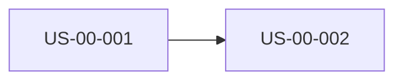

# Estimate

<!-- Template guidance: the size of the backlog as a set of written
     assumptions with a number attached, so the lead and the client can
     challenge each number. Points measure size and uncertainty, never days;
     only the phase plan carries weeks. Every comment says what goes there
     (What), what a strong entry has (Good) and an example (Example). Delete
     each comment when you fill its section. -->

Backlog: docs/product/backlog.md   Sized: <date>   Team: <n people, unconfirmed:>
Velocity assumption: <points per week, unconfirmed: unless given>

## 1. Story sizes

<!-- What: one row per live story with acceptance criteria: size, points,
     the previous size, the drivers and its assumption ids.
     Good: XS 1, S 2, M 3, L 5, XL 8; drivers named (boundary, schema or
     migration, integration, new UI, over four AC, unconfirmed assumption);
     two to four assumptions, each confirmed by a file or person or marked
     unconfirmed:. An XL is flagged "split with backlog". Never shrink a
     size to fit a date.
     Example: "US-00-014 | Match a report to a patient | L | 5 | M | boundary,
     integration | A3, A4, A5" -->

| Story | Title | Size | Points | Previous | Drivers | Assumptions |
| --- | --- | --- | --- | --- | --- | --- |
| US-00-001 | <title> | M | 3 | | boundary, UI | A1, A2 |

Assumptions (numbered, referenced above):

- A1. <what is taken as true; confirmed by <file or person>, or unconfirmed:>
- A2.

## 2. Refused (no acceptance criteria)

<!-- What: every story that has no AC-US- lines, so was not sized.
     Good: lists each id; the refusal stays whatever the story's source, and
     the verdict is partial while any row is here.
     Example: "US-01-006 | add AC with backlog, then re-run" -->

| Story | Action |
| --- | --- |
| <US-nn-nnn or none> | add AC with backlog, then re-run |

## 3. Dependency graph

<!-- What: a mermaid graph LR drawn from every Dependencies line, then the
     cycles found by following the edges.
     Good: stories with no edges still appear as nodes; a cycle, or a
     dependency on a story not in the backlog, is a gap named with its ids,
     never fixed silently.
     Example: "Cycles: US-00-014 to US-00-016 to US-00-014" -->

Cycles: <none, or the ids in each cycle>

## 4. Phase plan

<!-- What: phases of one to two weeks, ordered by dependencies, then Must
     before Should before Could, with points and a demo sentence each.
     Good: the demo is something a user can perform at the end; one that
     starts with "the backend" or "the schema" means re-slice vertically.
     To meet a date, cut scope here and name the stories that moved out.
     Example: "2 | 3 to 4 | US-00-014, US-00-016 | 8 | a receptionist files
     a real lab report against the right patient" -->

| Phase | Weeks | Stories | Points | Demo at the end |
| --- | --- | --- | --- | --- |
| 1 | 1 to 2 | US-00-001, US-00-002 | 5 | <a user can ...> |

## 5. Risks

<!-- What: what could make the estimate wrong, with likelihood, impact,
     mitigation and the stories or phase it threatens.
     Good: at least one per phase and one per third-party integration; the
     mitigation is an action someone can take, not "monitor".
     Example: "R2 | lab email formats differ by lab | high | US-00-014 grows
     to XL | collect five sample reports before phase 2 | US-00-014, phase 2" -->

| # | Risk | Likelihood | Impact | Mitigation | Threatens |
| --- | --- | --- | --- | --- | --- |
| R1 | | low / medium / high | | | US-nn-nnn, phase n |

## 6. Total

<!-- What: the sum of sized points, the band and the confidence.
     Good: band 0.8 to 1.5 times the sum while assumptions are unconfirmed,
     0.9 to 1.2 when all are confirmed; confidence is low over a third
     unconfirmed, medium up to a third, high at none; weeks use the stated
     velocity, marked unconfirmed: unless the user gave it.
     Example: "Points: 64   Band: 51 to 96   Confidence: low (9 of 22
     assumptions unconfirmed, 1 XL to split)" -->

Points: P   Band: L to H   Confidence: low | medium | high
Basis: <share of unconfirmed assumptions, XL stories still to split>

## 7. Task hours

<!-- What: the hours for every task in docs/product/tasks.md, rolled up by
     discipline and by story, next to the story's points.
     Good: hours are 1, 2, 3, 4, 6 or 8 for one person of the named
     discipline; a task over 8 is listed as "split", never written as a big
     number; the roll-up line is the coverage gate's "tasks:" line copied
     verbatim, or marked hand-summed: when the gate is not installed; a
     story whose hours sit under 3 or over 12 per point is listed so the
     two estimates can be reconciled.
     Example: "US-00-014 | 5 | 38 | backend 22, frontend 8, qa 8 | 7.6 h a
     point | ok" -->

| Story | Points | Hours | By discipline | Hours per point | Check |
| --- | --- | --- | --- | --- | --- |
| US-nn-nnn | 3 | 20 | backend 12, qa 8 | 6.7 | ok / mismatch / split: US-nn-nnn-Dk |

<the coverage_check "tasks:" line, verbatim, or hand-summed: <hours by discipline>>
