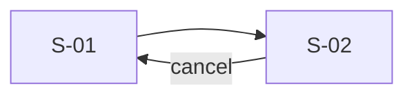
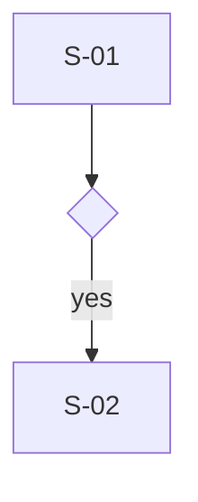
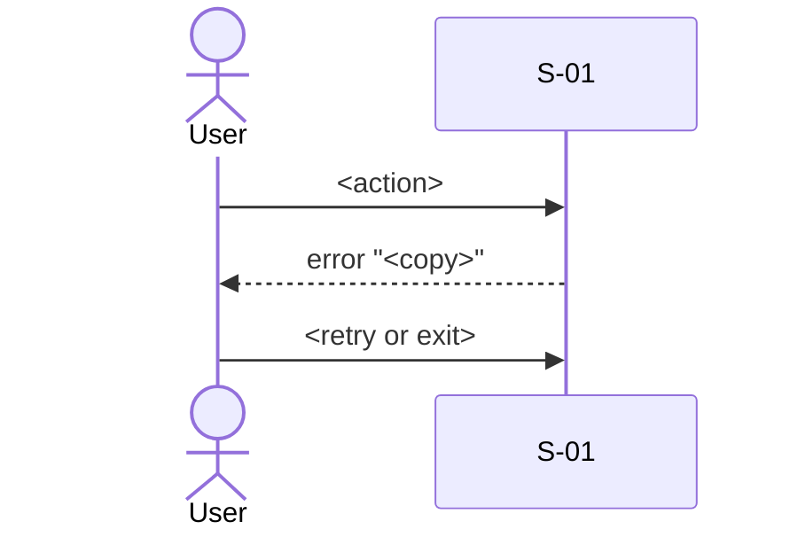

# UX flows: <feature> (v<n>)

<!-- Template guidance: the flow package for one feature: every screen with
     the stories it serves, every state with its copy, the storyboard, the
     navigation and flows in mermaid, and a dead-end check that must read
     zero. Designers and engineers read it before any visual design, and
     design-directions builds from it. flows_check.py parses the screen
     inventory, the mermaid flowcharts and the S-nn state tables, so keep
     those headings and table columns. Screen ids are stable across
     versions: add ids, never renumber. Delete each comment when you fill
     its section. -->

Source: <backlog path | PRD path | ticket id | pasted brief>
Stories: US-.., US-..   Goal: <one sentence, the user's words>
Date: <YYYY-MM-DD>   Author: <name or "unattributed">

## Changes from v<n-1>

<!-- What: on a re-issue with feedback only, placed first: every change and
     the feedback it answers. Delete the section in a first version.
     Good: one row per change, the feedback quoted, the screen ids touched;
     the previous version's file is kept, not overwritten.
     Removed screens keep their id, marked removed; list where each thing
     they carried went (copy, disclosures, errors, events) and every
     review note or ticket that cites a changed or removed id.
     Example: 1 | "Users miss the save state" | S-03 success now moves
     focus to the "Saved" banner | S-03 -->

| # | Feedback | Change | Screens touched |
| --- | --- | --- | --- |

## 0. Spec against code

<!-- What: the ledger from step 2, read from the handlers, router and
     pricing or limit tables the flow touches, before any screen is drawn.
     Good: each rejection names its code and file; each number says how it
     is counted and gives the value for the request's own example; each
     route or endpoint the flow needs is exists / new; each conflict names
     both sources and points to its open question.
     Example: Limit | invites per workspace | 10 a minute, fixed window
     (src/server/rateLimit.js) | a list of 12: 10 go now, 2 wait |
     exists -->

| Kind | Item | What the code does (file) | For this request | Spec says / status |
| --- | --- | --- | --- | --- |
| rejection | <CODE> | <when it fires> | error cell on S-.. | |
| number | <limit, cap, price, expiry> | <value and how it is counted> | <computed for the example> | <spec value if it differs> |
| route | <path or endpoint> | exists / not registered | | new / dependency |
| guard missing | <stale state> | <what the code does if the item changed> | state on S-.. | backend note |

## 1. Screen inventory

<!-- What: one row per screen and per modal, with the stories it serves,
     where the user enters from and where they can go.
     Good: every story maps to at least one screen, or is listed below and
     moved to open questions; screen names reuse the code's routes and
     components (reused / new); a dialog is a screen and has cancel; a
     screen that legitimately ends the journey says "terminal: <reason>"
     in Exits to.
     Example: S-04 | Order placed | Confirms the order and its number |
     US-05-002 | S-03 confirm | terminal: journey complete, link to S-01 |
     new -->

| Id | Screen | Purpose (one sentence) | Serves | Entry from | Exits to | Status |
| --- | --- | --- | --- | --- | --- | --- |
| S-01 | <name> | <what the user gets done here> | US-.. | <route, S-xx, deep link> | S-.., back | reused / new |
| S-02 (modal) | <name> | | | | cancel, confirm | |

Stories with no screen: none | <ids, moved to open questions>

## 2. Interaction states

<!-- What: one "### S-nn <name>" table per inventory screen. Every cell says
     what the user sees and gives the copy in quotes.
     Good: loading, empty, error and success on every screen; partial when
     it shows a list, a batch or data from more than one source; offline
     when the feature writes data or targets a phone; one error row per
     rejection in section 0, each with a next step; a state
     that cannot occur reads "n/a: reason", never blank. "Shows a spinner"
     is not filled: the copy is the deliverable. -->

### S-01 <name>

<!-- What: the state table for this one screen.
     Good: buttons carry a verb and keep it ("Publish" then "Published");
     the error says what happened and what to do next and keeps typed
     input; the empty state invites the first action; no apology words.
     Example: error | inline under the card field, the rest of the form
     stays filled | "Your card was declined. Try another card or contact
     your bank." -->

| State | The user sees | Copy |
| --- | --- | --- |
| loading | skeleton of <what>, primary action disabled | "<label>" stays visible |
| empty | <one invitation, one action> | "<headline>" / "<button verb>" |
| error | <where the message sits, what stays usable> | "<what happened>. <what to do>." |
| success | <the confirmation and where focus goes> | "<past tense of the button verb>" |
| partial | <what loaded, what did not, the retry> | "<n of m shown>. <action>" |
| offline | n/a: <reason> | |

## 3. Journey storyboard

<!-- What: the goal, one row per step (does, sees, feels, and how the
     design answers the feeling), then the five-second and five-minute
     reads.
     Good: feelings are specific ("unsure the payment went through"), and
     each one gets a named element or line of copy in response; the
     five-second read is what a stranger gets from the first screen alone.
     Example: 3 | Presses "Pay 1,240 rupees" | S-03 button spinner, label
     kept | anxious about paying twice | button disabled, "Paying..." -->

Goal: <what the user is trying to get done, in their words>

| Step | User does | User sees | User feels | Design answers with |
| --- | --- | --- | --- | --- |
| 1 | <arrives from> | S-01 <first thing on screen> | <emotion> | <the element or copy> |

Five-second read: <what a stranger understands from the first screen>
Five-minute read: <what they can do after five minutes>

## 4. Navigation map

<!-- What: a mermaid flowchart of every screen and how they connect.
     Good: node ids or labels start with the screen id (S01[S-01 Cart]);
     every inventory screen appears here and nothing else does; every
     screen has an outgoing edge unless it is terminal ("%% terminal: S-nn
     reason" inside the block also marks one).
     Example: a node written S03[S-03 Payment] with a "cancel" edge back
     to S02[S-02 Cart]. -->



## 5. Flows

<!-- What: the happy path, each alternate path, and one error-recovery
     flow per error cell in section 2, as mermaid flowchart or
     sequenceDiagram.
     Good: flows use the same screen ids as the inventory; decisions are
     diamond nodes with the condition written out; count decisions that
     need reading, not clicks: three obvious steps beat one puzzling one. -->

### Journey

<!-- What: the flow in words before the diagrams: who, on what, what
     starts it, what must hold first, the steps screen by screen, the
     alternate paths, what happens when it fails, and the state it leaves
     behind. Repeat this block and the diagrams below for each journey the
     feature has.
     Good: the persona and platforms come from the stories (never "all");
     the trigger is a real-world event; every step names an inventory
     screen id; "The system" is the observable reply (a record, a message,
     where focus lands), not "processes"; every alternate and failure row
     has its diagram below and its copy in section 2; Exercises lists every
     story the steps and paths touch.
     Example: "2 | S-02 Cart | presses Checkout | shows S-03 Payment with
     the total and the saved card preselected" -->

Persona: <name, group nn>   Platforms: <web / Android / iOS / desktop>
Trigger: <the event that starts it>   Exercises: US-.., US-..

Before it starts:
- <state a tester can set up: account, data, device>

| Step | Screen | The user | The system |
| --- | --- | --- | --- |
| 1 | S-01 <name> | <action> | <observable reply> |

| At step | Alternate path (condition) | What happens |
| --- | --- | --- |
| 2 | <the user chooses differently> | <where it goes and where it rejoins> |

| At step | When it fails (condition) | What the user sees | Recovery |
| --- | --- | --- | --- |
| 3 | <timeout, invalid input, denied> | "<copy from section 2>" | <retry, edit, leave with work kept> |

Afterwards: <the end state: records, messages sent, where the user is>

### Happy path

<!-- What: the main route from entry to the goal.
     Good: the fewest decisions that need thought, ideally none; every
     branch names its condition.
     Example: S-02 Cart, then a diamond "Signed in?", yes to S-03
     Payment, no to S-06 Sign in. -->



### Alternate: <name>

<!-- What: one subsection per other valid route to the goal.
     Good: the heading names the route; it rejoins the happy path at a
     named screen.
     Example: "Alternate: guest checkout": S-02 to S-05 Guest details,
     rejoining at S-03 Payment. -->

```mermaid
flowchart TD
```

### Error recovery: <error cell it recovers from>

<!-- What: one subsection per error cell, showing how the user gets out.
     Good: the error copy is quoted as in the state table; the way out is
     retry, edit the input or leave with the work kept; "Something went
     wrong" and lost input both fail.
     Example: "Error recovery: S-03 card declined": the user edits the card
     and retries; the address fields stay filled. -->



## 6. Decision points and dead-end check

<!-- What: every branch with its condition and the screens on each side;
     then, per screen, its way forward and its way back.
     Good: a modal's way back is a named control, not the browser alone; a
     dead end found here is fixed in the package, not reported; the Dead
     ends line is copied from flows_check.py and must read 0.
     Example: S-05 (modal) | "Remove item" to S-02 | "Keep item" closes to
     S-02 | no -->

| Branch | Condition | If yes | If no |
| --- | --- | --- | --- |

| Screen | Way forward | Way back | Dead end |
| --- | --- | --- | --- |
| S-01 | <control> to S-.. | browser back / <control> | no |

Dead ends: 0

## 7. Interaction inventory

<!-- What: every control on every screen with its label, type, target size,
     keyboard path and analytics event.
     Good: labels are literal verb-noun copy; targets are at least 44 px for
     touch and 24 px for pointer, larger when the flow is hurried; the event
     is the sheet's name, "no sheet", or "needs event: <proposed>", never
     an invented name.
     Example: S-03 | Pay button | button | "Pay 1,240 rupees" | 48 px |
     Tab 6, Enter | needs event: payment_submitted -->

| Screen | Control | Type | Label | Target | Keyboard | Event |
| --- | --- | --- | --- | --- | --- | --- |
| S-01 | <control> | button / link / input / toggle | "<verb noun>" | 44 px | Tab 3, Enter | <sheet name> / no sheet / needs event: <proposed> |

## 8. Open questions

<!-- What: every unresolved question, including unmapped stories, open
     review checks and destructive actions with no undo window.
     Good: each has an owner, a date, and what ships if it is deferred,
     written as the literal fallback.
     Example: 2 | Do we keep a cart for 30 days for guests? | Priya (PM) |
     2026-10-02 | engineer ships a session-only cart -->

| # | Question | Owner | By | If deferred, what ships |
| --- | --- | --- | --- | --- |

## 9. Self-review

<!-- What: one row per check in references/flow-review.md (F1 onwards),
     each pass, fixed or open, or "n/a: reason".
     Good: F2 (dead ends) and F4 (state coverage) take their result from
     flows_check.py, not from reading; every open row also appears in
     section 8 with its check id; F2 can never be open.
     Example: F5 copy is written | fixed | S-02 "Submit" became "Place
     order" -->

| Check | Result | Note |
| --- | --- | --- |
| F1 fewest thoughts | pass / fixed / open | |
